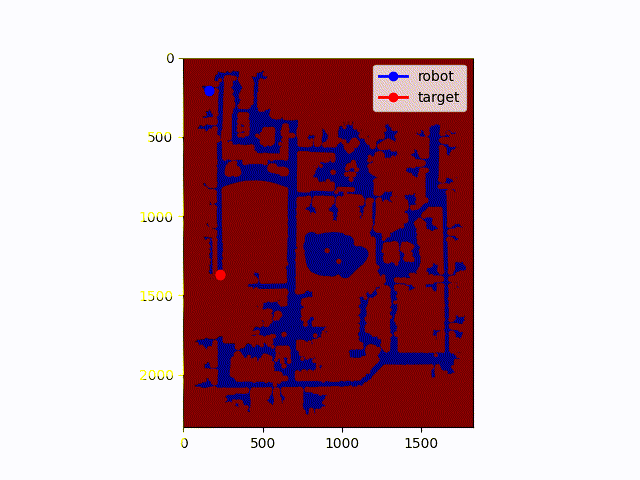

# catching-a-moving-target

## Strategy 1: Trajectory Endpoint Intercept
Perform **A* Search** on the last node of the target trajectory. Once the robot reaches the terminal node, it follows the path until it intercepts the target.

### Performance Comparison

| Metric | Baseline Run | Baseline Run 2|
| :--- | :---: | :---: |
| **Visual** |  |  |
| **Target Caught** | 1 | 0 |
| **Target Steps** | 2,882 | 5,245 |
| **Time Taken (s)** | 2,882 | 5,244 |
| **Moves Made** | 2,882 | 3,958 |
| **Path Cost** | 2,882 | 8,306,796 |

---

## Strategy 2: Reverse A search 

This planer performs an A search with no huerisitc. It continues to expand cells until all the cells on the target's trajectory have been expanded. When it expands a target trajectory cell, it checks if the robot can reach the cell in time before the target gets there, if so the cost of getting to that cell is added into a priority queue. If the robot gets to the spot early, the cost of waiting in that cell is calculated and added to the origonal cost. After it has expanded all target trajectory cells, it pops the cell with the lowest cost and backtracks on a vector list of parents in order to get the next move to make. Origonally, I used maps, sets, and vectors to keep track of my data, however this proved to be extremely slow. So I changed them all to vectors significantly imrpoved the time effecianecy. For exmaple on grad map2, one iteration would take 2000> ms, this change in data structures dropped the time to 300ms. 

### Performance Comparison

| Metric | Baseline Run | Baseline Run 2|
| :--- | :---: | :---: |
| **Visual** |  |  |
| **Target Caught** | 1 | 1 |
| **Target Steps** | 5,345 | 5,245 |
| **Time Taken (s)** | 2,640 | 5,012 |
| **Moves Made** | 2,639 | 1,529 |
| **Path Cost** | 2,640 | 1,993,887 |

---
