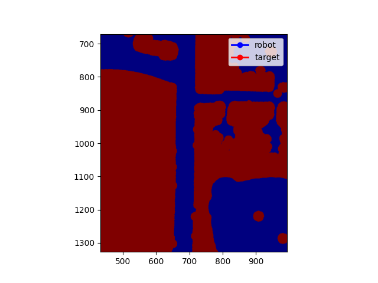

# catching-a-moving-target

## Strategy 1:
Perform A* Search on last node of target trajectory. When the robot gets to the last node, follow the path until it intercepts the target.

### RESULT

target caught = 1

time taken (s) = 2882

moves made = 2882

path cost = 2882

### RESULT

target_steps = 5245

target caught = 0

time taken (s) = 5244

moves made = 3958

path cost = 8306796
