# Catching a Moving Target

This document describes the planning strategies I developed to intercept a moving target on a grid. It outlines how the approaches evolved over time and evaluates each strategy using both visual results and quantitative performance metrics.

> **Note on Evaluation:** While this document outlines the evolution of the project, **Strategy 3** represents the final optimized approach. Strategies 1 and 2 are included for comparative analysis and to document the development process.

## Compilation and Execution

The planner can be compiled using the standard command as there are no external dependencies:
`g++ runtest.cpp planner.cpp`

For more efficient testing, I have included a shell script, `run.sh`, which automates the compilation, execution, and visualization steps into a single command. 

### Usage:
Run the script followed by the student type (`g` for grad or `u` for undergrad) and the map number.

**Example:**
```bash
./run.sh g 2
```

## Strategy 1: Trajectory Endpoint Intercept

This strategy performs **A\*** search toward the final node of the target’s known trajectory. Once the robot reaches this terminal node, it follows the trajectory until it intercepts the target.

The implementation uses sets, vectors, and priority queues to represent the open list, closed list, and expanded states. This method performed reliably on most maps and guaranteed interception (except in `/grad/map2`, where planning time occasionally became too large). By navigating directly to the final point on the trajectory, the robot ensures eventual interception by simply waiting or following the path.

However, this approach does **not optimize path cost**. It prioritizes guaranteed interception over efficiency. The following strategies aim to address this limitation.

### Performance Comparison

| Metric | Baseline Run | Baseline Run 2 |
| :--- | :---: | :---: |
| **Visual** |  |  |
| **Target Caught** | 1 | 0 |
| **Target Steps** | 2,882 | 5,245 |
| **Time Taken (s)** | 2,882 | 5,244 |
| **Moves Made** | 2,882 | 3,958 |
| **Path Cost** | 2,882 | 8,306,796 |

---

## Strategy 2: Reverse Uninformed A Search (No Heuristic)

This planner performs a **reverse uninformed A search**, removing the heuristic component entirely. Instead of targeting only the final trajectory node, the planner expands nodes until *all* cells along the target’s trajectory have been explored.

When a trajectory cell is expanded, the planner checks whether the robot can reach that cell before the target arrives. If so, the cell and its associated cost are added to a priority queue of candidate interception points. If the robot arrives early, the waiting cost is computed and incorporated into the total cost before insertion.

After all trajectory cells have been processed, the planner selects the lowest-cost candidate and reconstructs the path using a parent vector.

This strategy significantly improves cost optimization compared to Strategy 1. However, computational efficiency became the main bottleneck. On `/grad/map2`, planning initially took over **2000 ms** per iteration.

The original implementation relied heavily on maps and sets. Replacing these with vector-based data structures dramatically improved performance. On **/grad/map2**, runtime decreased from over **2000 ms** to approximately **300–400 ms** per iteration.

### Performance Comparison

| Metric | Baseline Run | Baseline Run 2 |
| :--- | :---: | :---: |
| **Visual** |  |  |
| **Target Caught** | 1 | 1 |
| **Target Steps** | 5,345 | 5,245 |
| **Time Taken (s)** | 2,640 | 5,012 |
| **Moves Made** | 2,639 | 1,529 |
| **Path Cost** | 2,640 | 1,993,887 |

---

## Strategy 3: Reverse Uninformed A Search with Waiting (Time-Expanded)

From observing Strategy 2 on `/grad/map2`, I noticed that once the planner selected the minimum-cost interception point, the robot would often wait there until the target arrived. However, this waiting always occurred at the terminal cell of the chosen path.

To improve flexibility, I extended the state space to include **time as a third dimension**. This allows the planner to explicitly choose to **wait in place** at any step rather than only at the final node.

By allowing wait actions within the search itself, the robot can synchronize arrival time with the target more precisely, leading to significantly improved interception efficiency.

The tradeoff is increased computation. On `/grad/map2`, planning time increased from **300–400 ms** (Strategy 2) to approximately **800–900 ms** due to the expanded state space.

### Performance Comparison

| Metric | Baseline Run | Baseline Run 2 |
| :--- | :---: | :---: |
| **Visual** | 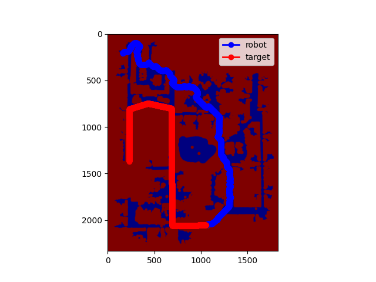 | 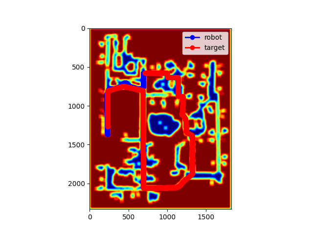 |
| **Target Caught** | 1 | 1 |
| **Target Steps** | 5,345 | 5,245 |
| **Time Taken (s)** | 2,640 | 4,672 |
| **Moves Made** | 2,639 | 1,235 |
| **Path Cost** | 2,640 | 1,599,074 |

---

## Additional Strategy 3 Results

All results below were generated using **Strategy 3**, which consistently achieved the best overall performance.

| Map | Visual | Target Steps | Time Taken | Moves Made | Path Cost |
|:--:|:--:|:--:|:--:|:--:|:--:|
| G3 | 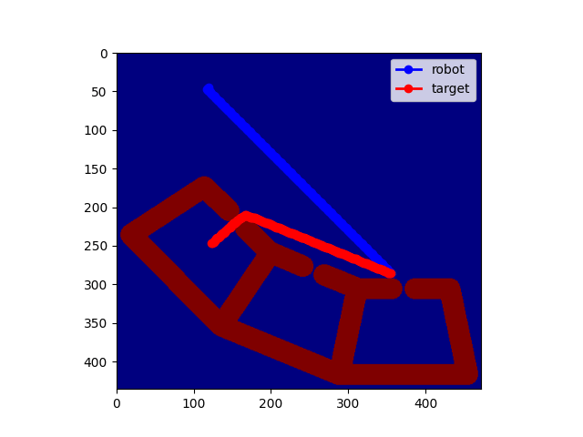 | 792 | 241 | 241 | 241 |
| G4 | 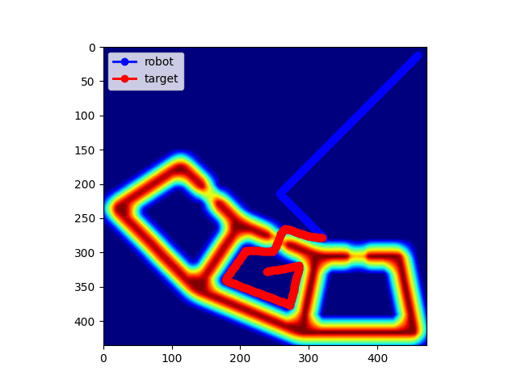 | 792 | 379 | 266 | 379 |
| G5 | 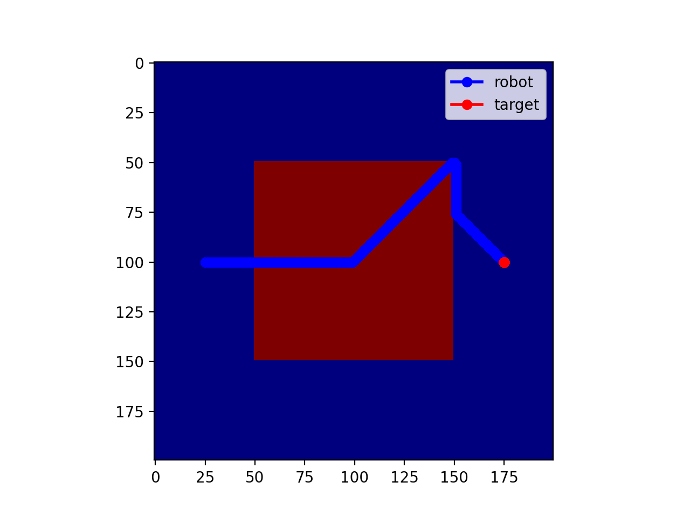 | 182 | 175 | 175 | 4,977 |
| G6 | 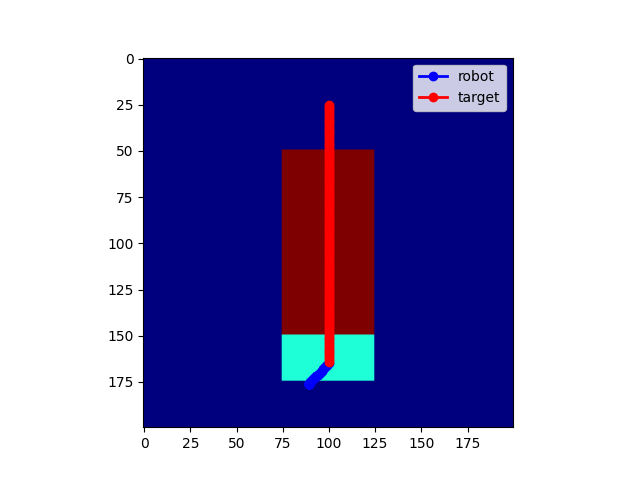 | 141 | 140 | 22 | 539 |
| G7 | 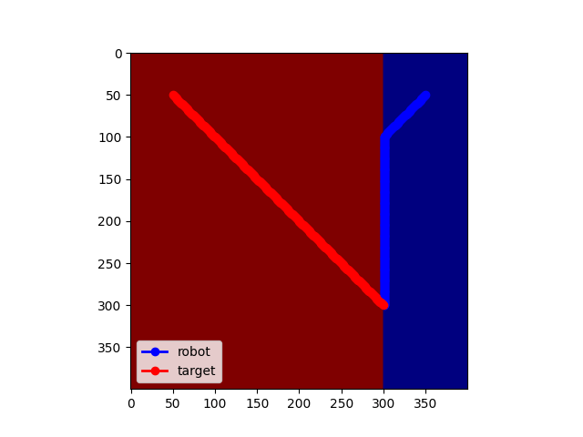 | 301 | 251 | 251 | 251 |
| G8 | 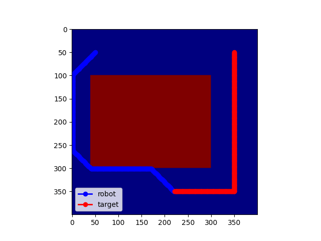 | 452 | 431 | 430 | 431 |
| G9 | 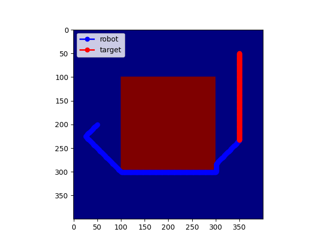 | 602 | 368 | 367 | 368 |
| G10 | 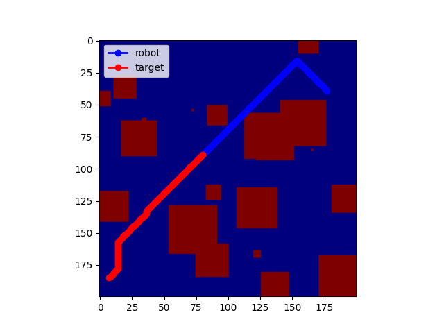 | 166 | 97 | 96 | 97 |
| G11 | 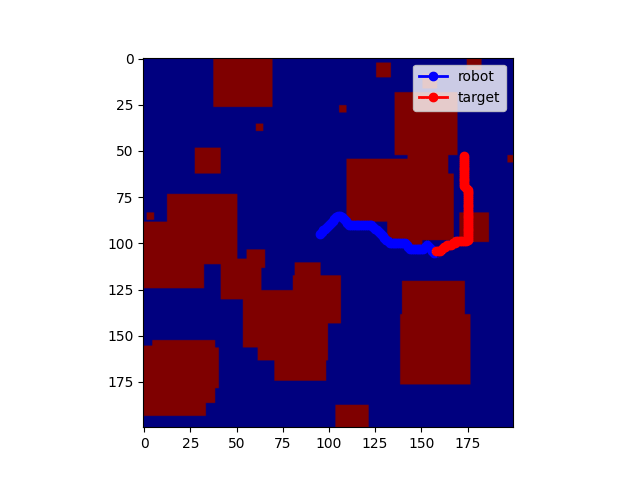 | 100 | 63 | 62 | 63 |
| G12 | 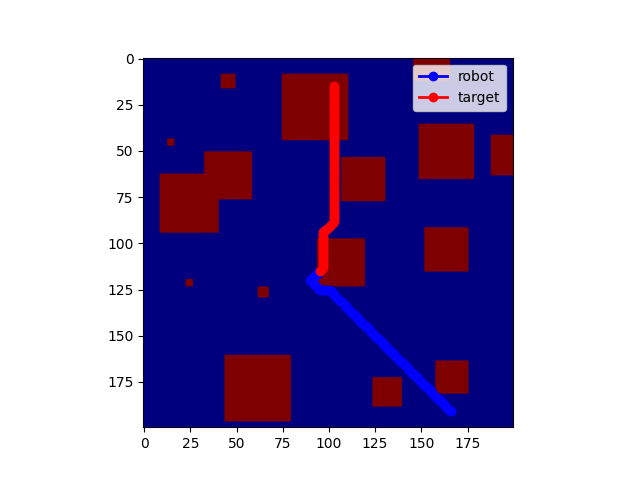 | 100 | 63 | 62 | 63 |
