# Catching a Moving Target

This project explores multiple planning strategies for intercepting a moving target on a grid. Each strategy is evaluated using both visual results and quantitative performance metrics.

---

## Strategy 1: Trajectory Endpoint Intercept

This strategy performs **A\*** search to the final node of the target’s trajectory. Once the robot reaches this terminal node, it follows the path until it intercepts the target.

### Performance Comparison

| Metric | Baseline Run | Baseline Run 2 |
| :--- | :---: | :---: |
| **Visual** |  |  |
| **Target Caught** | 1 | 0 |
| **Target Steps** | 2,882 | 5,245 |
| **Time Taken (s)** | 2,882 | 5,244 |
| **Moves Made** | 2,882 | 3,958 |
| **Path Cost** | 2,882 | 8,306,796 |

---

## Strategy 2: Reverse A* Search (No Heuristic)

This planner performs a reverse A* search **without a heuristic**. It continues expanding cells until all cells on the target’s trajectory have been expanded.

When a target trajectory cell is expanded, the planner checks whether the robot can reach that cell before the target arrives. If so, the cost to reach that cell is added to a priority queue. If the robot arrives early, the cost of waiting at that cell is calculated and added to the total cost.

After all trajectory cells have been expanded, the planner selects the lowest-cost candidate from the priority queue and backtracks using a parent vector to determine the next move.

Originally, maps, sets, and vectors were used to store planner data, but this proved to be extremely slow. Replacing all data structures with vectors significantly improved performance. For example, on **grad/map2**, a single iteration originally took over **2000 ms**, while the optimized version runs in approximately **300 ms**.

### Performance Comparison

| Metric | Baseline Run | Baseline Run 2 |
| :--- | :---: | :---: |
| **Visual** |  |  |
| **Target Caught** | 1 | 1 |
| **Target Steps** | 5,345 | 5,245 |
| **Time Taken (s)** | 2,640 | 5,012 |
| **Moves Made** | 2,639 | 1,529 |
| **Path Cost** | 2,640 | 1,993,887 |

---

## Strategy 3: Reverse A* Search with Waiting (Time-Expanded)

This strategy extends Strategy 2 by adding **time as a third dimension** in the search space. This allows the planner to explicitly choose to **wait in place** rather than making a movement at every step.

Allowing wait actions significantly improves interception performance by enabling the robot to arrive at optimal interception points exactly when the target does.

### Performance Comparison

| Metric | Baseline Run | Baseline Run 2 |
| :--- | :---: | :---: |
| **Visual** |  | 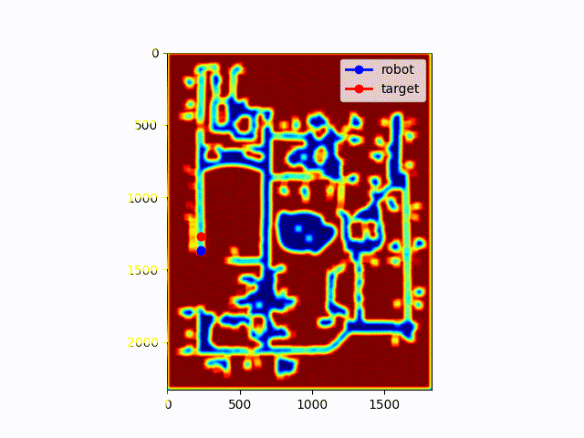 |
| **Target Caught** | 1 | 1 |
| **Target Steps** | 5,345 | 5,245 |
| **Time Taken (s)** | 2,640 | 4,672 |
| **Moves Made** | 2,639 | 1,235 |
| **Path Cost** | 2,640 | 1,599,074 |

---

## Additional Strategy 3 Results

**Note:** All results below were generated using **Strategy 3**.  
More experiments were run for this strategy because it consistently produced the best overall performance.

---

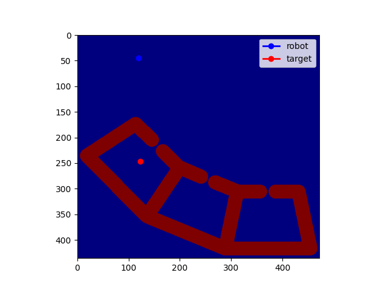

- target_steps = 792  
- target_caught = 1  
- time_taken (s) = 241  
- moves_made = 241  
- path_cost = 241  

---

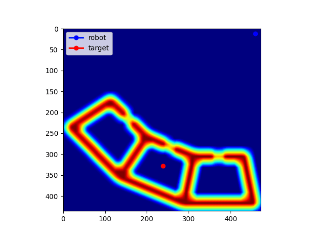

- target_steps = 792  
- target_caught = 1  
- time_taken (s) = 379  
- moves_made = 266  
- path_cost = 379  

---

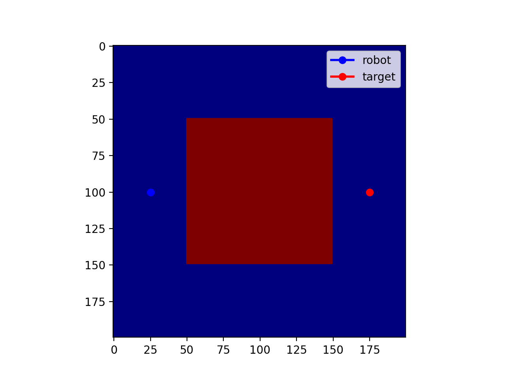

---

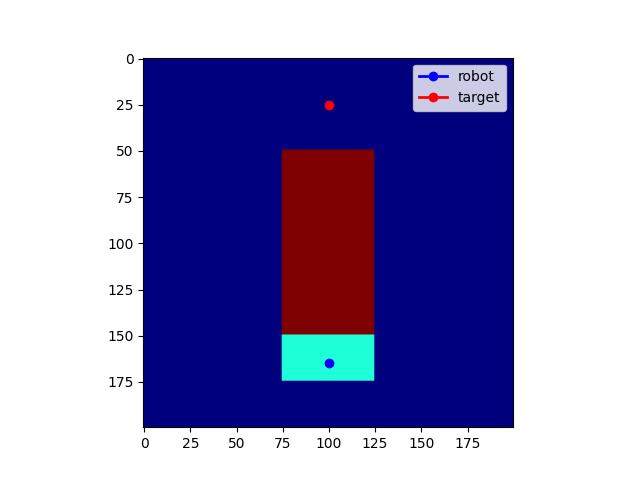

- target_steps = 141  
- target_caught = 1  
- time_taken (s) = 140  
- moves_made = 22  
- path_cost = 539  

---

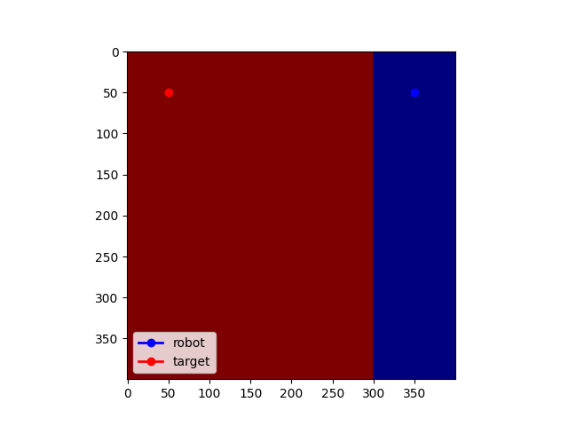

- target_steps = 301  
- target_caught = 1  
- time_taken (s) = 251  
- moves_made = 251  
- path_cost = 251  

---

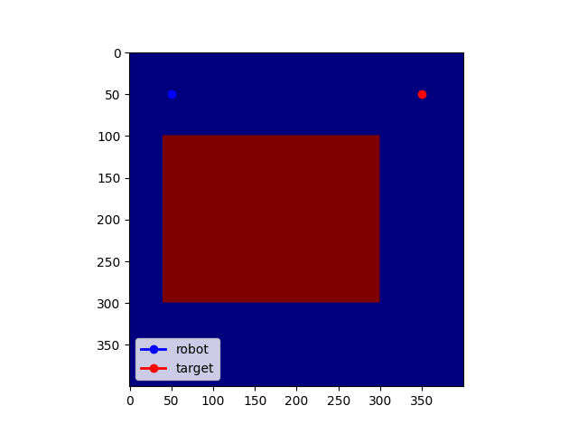

- target_steps = 452  
- target_caught = 1  
- time_taken (s) = 431  
- moves_made = 430  
- path_cost = 431  

---

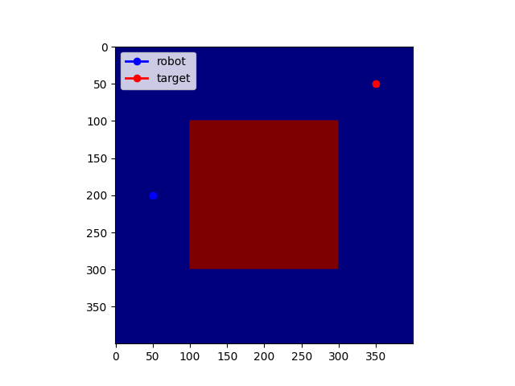

- target_steps = 602  
- target_caught = 1  
- time_taken (s) = 368  
- moves_made = 367  
- path_cost = 368  

---

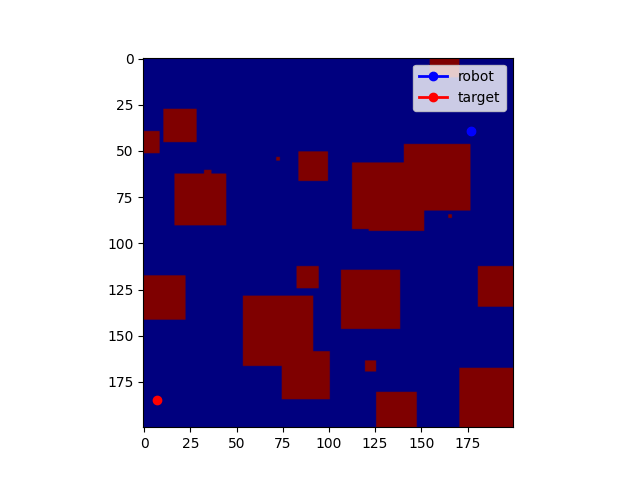

- target_steps = 166  
- target_caught = 1  
- time_taken (s) = 97  
- moves_made = 96  
- path_cost = 97  

---

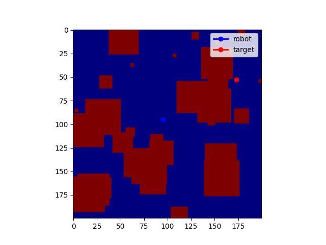

- target_steps = 100  
- target_caught = 1  
- time_taken (s) = 63  
- moves_made = 62  
- path_cost = 63  

---

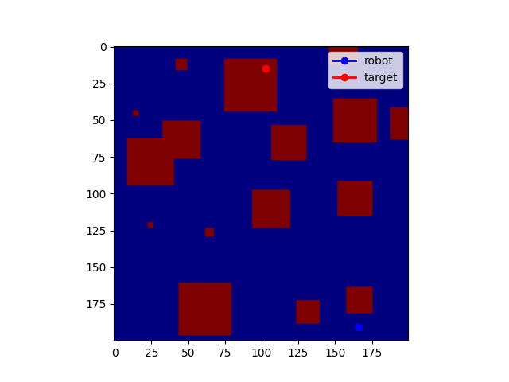

- target_steps = 100  
- target_caught = 1  
- time_taken (s) = 63  
- moves_made = 62  
- path_cost = 63  
